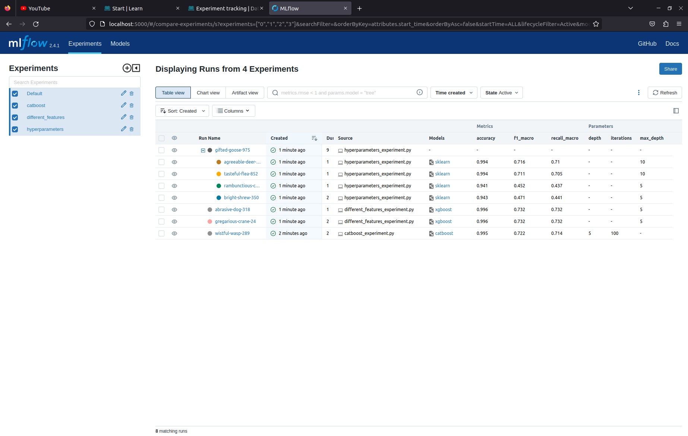

# Experiment tracking

In this directory we will be exploring the subject of Experiment tracking mainly with the usage of `MLflow`.

## Introduction

In this task we will be working with an unbalanced multiclass classification problem on a Thyroid Disease Data Set available here:
http://archive.ics.uci.edu/dataset/102/thyroid+disease

We will explore the data set and use `xgboost`, `catboost` and `RandomForestClassifier` to best classify our 4 different classes.

Our main metric will be `macro recall` because the main goal is to correctly classify all positive cases of every groups, and this being a unbalanced problem, macro ajdusted recall will take that into account. 

Parts of these code together with the data set were taken from my homework from Classification module from EPAM Data Science course.

## Installation of mlflow

To begin tracking with mlflow we need to install it first.

We will be installing the mlfow via terminal using `script.sh`. 

First we create a file called `script.sh`.
Then in the terminal we change the execution permission via:

```bash
chmod +x script.sh
```

In the script we input the following commands:

```bash
pip install mlflow
```
and:

```bash
mlflow --version
```
Which returns:

```bash
mlflow, version 2.4.1
```
This means that on my machine version 2.4.1 was installed.

## Docker-compose

The following command in the script is:

```bash
docker-compose up
```

Which runs our docker-compose file that is needed to setup the container and give specific commands. 

In the following part of this README we will go through the docker-compose file and break down the code written to create and run the containers.

## Containers 

### Server

Let's go through the first container that is our server:

```bash
  mlflow-server:
    build: ./mlflow-server
    image: mlflow-server-image:1.0.0 
    container_name: "mlflow-server-container-1"
    ports:
      - "5000:5000"
    networks:
      - mlflow-network
    volumes:
      - ./mlruns-volume:/mlflow/mlruns
    tty: true
    command: bash -c "mlflow server --backend-store-uri sqlite:///mlruns/mlruns.db --default-artifact-root file:mlruns/artifacts --host 0.0.0.0 --port 5000"
```

We build the server from our Dockerfile that is in the `./mlfow-server` relative path in this directory. The image is named `mlflow-server-image:1.0.0` and container is named `mlflow-server-container-1`. We connect port 5000 of the container to the port 5000 of our machine so we can access mlflow ui and check the experiments and runs. Both client and server are on a network called `mlflow-network` and we have a shared volume called `mlruns-volume` which will save our models, artifacts and all metrics we decide to keep. `tty: true` enables us to interact with this container in real time, if needed. The final command is 
`command: bash -c "mlflow server --backend-store-uri sqlite:///mlruns/mlruns.db --default-artifact-root file:mlruns/artifacts --host 0.0.0.0 --port 5000"` which sets our backend store and artifact root which define where we will save all our metrics, models and other artifacts.

### Client

Code for our client is presented here:

```bash
  mlflow-client:
    build: ./mlflow-client
    image: mlflow-client-image:1.0.0 
    container_name: "mlflow-client-container-1"
    networks:
      - mlflow-network
    volumes:
      - ./mlruns-volume:/mlflow/mlruns
    tty: true
    depends_on:
      - mlflow-server
    command: sh -c "dvc init --no-scm && dvc repro -R pipelines/"
```
In a similar manner, we create the image and the container, and connect them to the volume. `depends_on:` allows us to set dependencies and first run the server and then the client container. Finally the final command `command: sh -c "dvc init --no-scm && dvc repro -R pipelines/"` initalizes dvc in this container and then runs the recursive repro over the pipelines/ directory inside the container so all our experiments get reproduced and tracked with mlflow. 

This creates the experiments inside the `mlruns-volume` so they get stored (all metrics, models and other artifacts).

All scripts are inside the `src` directory which will be copied to the container and executed with dvc repro.

After the dvc reproduces all the pipelines we can view them.

To access the mlflow ui we type in `http://localhost:5000/` on our web browser and inspect our experiments.

We can see the saved metrics:
 - `accuracy`
 - `recall_macro`
 - `f1_macro`

Hyperparameters are also available for all runs, as well as models and their environment and artifacts which represent a confusion matrix of the classified cases of our test set.

In the next screenshot we can see our metrics:



We can see that the best model is `xgboost` but it seems that both runs have the same metrics. The reason for this is that we used only minor changed for our features. 

In the first set of features we used this strategy:

```bash
# Imputing missing values

categorical = df.select_dtypes(include=['object']).columns.tolist()
categorical.remove('Class')
ordinal = df.select_dtypes(include=['category']).columns.tolist()
numerical = df.select_dtypes(exclude=['category', 'object']).columns.tolist()

# Numerical

numerical_def = gen_features(
    columns=[[c] for c in numerical],
    classes=[
        {'class': SimpleImputer, 'strategy': 'median'},
        {'class': MinMaxScaler}
    ]
)

# Ordinal

ordinal_def = gen_features(
    columns=[[c] for c in ordinal],
    classes=[
        {'class': SimpleImputer, 'strategy': 'most_frequent'}
    ]
)

# Categorical

categorical_def = gen_features(
    columns=[[c] for c in categorical],
    classes=[
        {'class': SimpleImputer, 'strategy': 'constant', 'fill_value': 'missing'},
        {'class': OneHotEncoder, 'handle_unknown': 'ignore'}
    ]
)
```

While in the second set of features we used this strategy:

```bash
# Imputing missing values

categorical = df.select_dtypes(include=['object']).columns.tolist()
categorical.remove('Class')
ordinal = df.select_dtypes(include=['category']).columns.tolist()
numerical = df.select_dtypes(exclude=['category', 'object']).columns.tolist()

# Numerical

numerical_def = gen_features(
    columns=[[c] for c in numerical],
    classes=[
        {'class': SimpleImputer, 'strategy': 'mean'},
        {'class': StandardScaler}
    ]
)

# Ordinal

ordinal_def = gen_features(
    columns=[[c] for c in ordinal],
    classes=[
        {'class': SimpleImputer, 'strategy': 'most_frequent'}
    ]
)

# Categorical

categorical_def = gen_features(
    columns=[[c] for c in categorical],
    classes=[
        {'class': SimpleImputer, 'strategy': 'constant', 'fill_value': 'missing'},
        {'class': OneHotEncoder, 'handle_unknown': 'ignore'}
    ]
)

```

We can see that they are almost identical but in the first one for the numerical features we used `median` strategy on the `SimpleImputer` and `MinMaxScaler` and on the second one we used `mean` and `StandardScaler`. These transformations were not enough to make a significant difference on our models performance.

So as the best model we will keep the first one which used `median` and `MinMaxScaler`. This will be the model that will be pseudo-released.